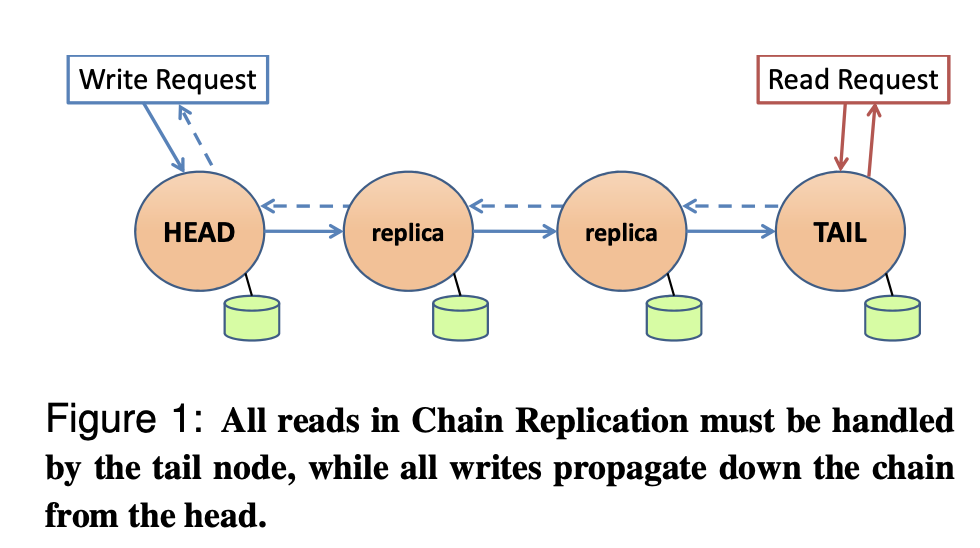

# Chain Replication CRAQ

1. It seems to be used in HDFS writing.
2. Why is CR attractive (vs Raft)?
   1. Client RPCs split between head and tail, vs Raft's leader handles both.
   2. Head sends each write just once, vs Raft's leader sends to all.
   3. Reads involve just one server, not all as in Raft.
   4. Situation after failure simpler than in Raft 
3. It cannot work alone, some authority (configuration manager) is needed to decide whether server is dead.
4. Although CRAQ can improve read throughput, clients cannot read from any server.
5. (CRAQ Improvement) Each replica stores a list of versions per object. One clean version, plus dirty version per recent write.
6. Write
    1. Client sends write to the head.
    2. Replicas create new dirty version as write passes through.
    3. Tail creates clean version, ACKs back along chain, replicas turn "dirty" to "clean".
7. Read from non-tail node
    1. If latest version is clean, reply with that.
    2. If dirty, ask tail for latest version number ("version query").
8. Because of the chain, all the nodes commit write the replica before the log commit. But Raft only needs majority, the minority's log may be wrong. So CRAQ can provide read from any server, but Raft cannot.

