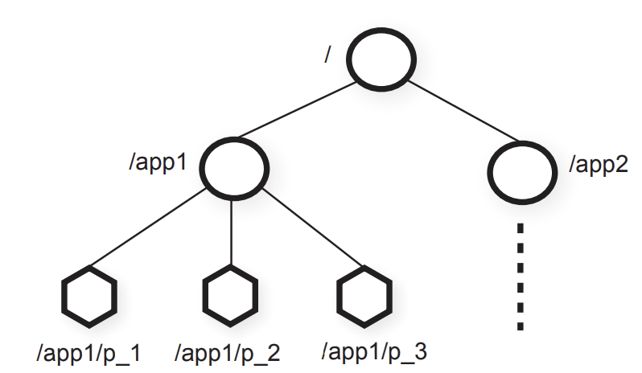

# ZooKeeper

1. Clients may try to resend request, so linearizable system should be able to filter duplicate requests.

2. More servers will not make write faster but even slower because leader must send replicas to each of followers.

   Read-only seems to be able to load-balanced to followers, but followers' log may not be up-to-date.

   So all the requests must be through the leader in Raft-like system.

3. Zookeeper allows to send read-only requests to followers by redefining correctness. Zookeeper is not obliged to provide fresh data.

4. ZK guarantees

   1. Linearizable writes

   2. FIFO client order

      each client specifies an order for its operations, it is only a client-side linearizable guarantee

      writes:
            writes appear in the write order in client-specified order

      reads:
            each read executes at a particular point in the log array
            a client's successive reads execute at non-decreasing points in the order
            a client's read executes after all previous writes by that client
            a server may block a client's read to wait for previous log to sync

5. Why is ZooKeeper useful despite loose consistency?

   1. sync() causes subsequent client reads to see preceding writes. useful when a read must see latest data
   2. Writes are well-behaved, e.g. exclusive test-and-set operations writes really do execute in order, on latest data.
   3. Read order rules ensure "read your own writes".
   4. Read order rules help reasoning.

6. Leader must preserve client write order across leader failure.

7. Replicas must enforce "a client's reads never go backwards in zxid order" despite replica failure.

8. Client must track highest zxid it has read to help ensure next read doesn't go backwards even if sent to a different replica.

9. 

   ZooKeeper's hierarchical name space, each one is a Znode (file names, file content, directories, path names)

10. Each znode has a version number

11. Types of znodes:

    1. regular
    2. ephemeral
    3. sequential: name + seqno

12. Operations on Znodes
    1. create(path, data, flags)
       exclusive -- only first create indicates success
    2. delete(path, version)
       if znode.version = version, then delete
    3. exists(path, **watch**)
       watch=true means also send notification if path is later created/deleted
    4. getData(path, watch)
    5. setData(path, data, version)
        if znode.version = version, then update
    6. getChildren(path, watch)
    7. sync()
       sync then read ensures writes before sync are visible to same client's read
       client could instead submit a write
13. User can use version to implement "mini-transaction" like CAS, but solve ABA problem
14. User can use lock file and watch to implement lock

